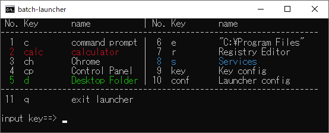

# batch-launcher

[README in Japanese](README.md)

## Overview
batch-launcher is a launcher created with batch files.
It is possible to execute Windows commands and applications with shortcut keys.

## Feature
* Set "Command", "Shortcut Key" and "Display Name" in CSV file
* Launcher starts in English in non-Japanese environments.
* Commands can be displayed in multiple columns in tabular format.
* Automatically adjust window size.
* Background and text color can be changed.

## Shortcut Key Settings
Enter key_list.csv in the following order, separated by commas ','.

1. Shortcut Key
2. Command
3. Display Name
4. Color

The following are notes.

* The existing settings are samples and should be changed (key_list-jp.csv is a sample for Japanese environment).
* The first line is a comment line.
* Newline code is CR + LF
* Japanese character code is Shift_JIS
* Text editor recommended for editing; Excel deprecated.
* If there is no "Display Name", "Command" shall be used as the "Display Name".
* If "Color" is not specified, follow the "Text Color" setting in settings.txt.
* "Color" is only valid for the fourth entry.

The following is an example setting for accessing a github.com page in Google Chrome. You can specify multiple arguments as well as the name of the command to execute. In this example, typing 'ch' will launch Chrome.

<pre>
ch,"C:\Program Files\Google\Chrome\Application\chrome.exe" https://github.com/,Chrome
</pre>

The following is an example of a setting to start the calculator. The commands and applications set in the PATH environment variable do not need to be in the full path.

<pre>
calc,calc,Calculator,red
</pre>

The following is an example of how to open the "C:\Program Files" folder with Explorer. Simply enter the folder name in the "Command" field. If the folder contains spaces, you need to enclose it with double quotation marks '"'.

<pre>
e,"C:\Program Files"
</pre>

## Launcher main unit settings
You can change the launcher settings at "settings.txt".
|No.|Name|Initial|Format|Description|
|-:|-|-|-|-|
|1|LOOP|YES|YES or NO|resident in an infinite loop|
|2|EXIT_KEY|q|string|exit shortcut key|
|3|BACKGROUND_COLOR|black|color setting value|background color|
|4|TEXT_COLOR|white|color setting value|text color|
|5|COLUMN_NUM|2|integer greater than or equal to 1|number of columns|
|6|DISPLAY_NUMBER|YES|YES or NO|display the number.|
|7|EQUALIZE_CELL_WIDTH|NO|YES or NO|equalize cell widths.|
|8|ARRANGE_VERTICAL|YES|YES or NO|arrange vertically. When 'NO' is selected, horizontally.|

## Color settings
batch-launcher has the following 16 colors available.

|No.|Color|Color Name|Set Values|
|-:|-|-|-|
|1||White|white, 白|
|2||Black|black, 黒|
|3||Red|red, 赤|
|4||Yellow|yellow, 黄|
|5||Green|green, 緑|
|6||Blue|blue, 青|
|7||Aqua|aqua, 水|
|8||Purple|purple, 紫|
|9||Bright White|white_b, 白明|
|10||Gray|gray, black_b, 灰, 黒明|
|11||Light Red|red_b, 赤明|
|12||Light Yellow|yellow_b, 黄明|
|13||Light Green|green_b, 緑明|
|14||Light Blue|blue_b, 青明|
|15||Light Aqua|aqua_b, 水明|
|16||Light Purple|purple_b, 紫明|

 
Set values can be in alphabetic or Kanji format. The Kanji format is valid only when the character code of the setting file is Shift_JIS.
 
The following is an example of specifying colors in key_list.csv.
<pre>
calc,calc,calculator,red
s,services.msc,Services,緑
</pre>

The following is an example of specifying colors in settings.txt.
<pre>
BACKGROUND_COLOR=black
TEXT_COLOR=青明
</pre>

## How to Install
1. Place the following files in the same folder
* settings.txt
* key_list.csv
* launcher.bat

2. Add the folder mentioned earlier to the Path environment variable.
* Execute the command `systempropertiesadvanced` with "Windows key + R" to change the environment variables in the advanced system settings.

## Intended use
You may run `launcher.bat` from a command prompt or other means, but one of the following uses is assumed.
* Type "Windows key + R" to launch the batch file from "Run".
  * Set the Path environment variable and if you rename launcher.bat to l.bat, you can start it by just typing `l`.
  * In this case, the resident setting should be "LOOP=NO".
* Launch `launcher.bat` from [AutoHotKey](https://www.autohotkey.com/).
  * Please refer to the sample setting files for ver1 and ver2 of AutoHotKey in the repository ( Press Pause key to active or run ).
  * In this case, the resident setting should be "LOOP=YES".

## Display position setting
To display batch-launcher in a fixed position on the desktop each time, you can create a symbolic link for `launcher.bat` and set the "Window Location".
Symbolic links can be set from the Layout tab by right-clicking on the link and displaying its properties.
Don't forget to change it to start from this symbolic link when starting from AutoHotKey, etc.
