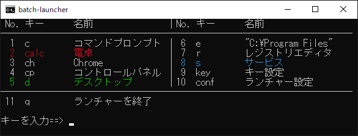

# batch-launcher

[README in English](README-en.md)

## 概要
batch-launcherはバッチファイルで作成したランチャーです。
ショートカットキーでWindowsのコマンドやアプリを実行することが可能です。

## 特徴
* CSVファイルで「実行するコマンド」、「ショートカットキー」を設定する。
* 日本人向けに作成しているが、日本語環境以外では英語表記でランチャーが起動する。

## ショートカットキーの設定
key_list.csvに以下の順番でカンマ','区切りで記述する。

1. ショートカットキー
2. 実行するコマンド
3. 表示名

以下は注意事項。

* 既存の内容はサンプルなので変更してください（key_list-jp.csvは日本語環境用のサンプル）。
* 編集はテキストエディタ推奨。Excel非推奨。
* 1行目はコメント行
* 「表示名」がない場合は「実行するコマンド」を「表示名」とする。

## ランチャー本体の設定
config.txtを変更することで以下の設定が可能です。
* 常駐の有無（初期値：NO）
* ウィンドウサイズ（初期値：45 x 25）
* 表の罫線の長さ（初期値：40）
* 終了のショートカットキー（初期値：q）

## インストール方法
1. 同じフォルダに以下のファイルを置く。
* config.txt
* key_list.csv
* launcher.bat

2. Path環境変数に先程のフォルダを追加する。
* ”Windowsキー＋R”でコマンド`systempropertiesadvanced`を実行して、システムの詳細設定から環境変数を変更する。

## 想定する使用方法
`launcher.bat`をコマンドプロンプトなどから実行しても良いが、以下のいずれかの使用方法を想定している。
* ”Windowsキー＋R”を入力して「ファイル名を指定して実行」から`launcher.bat`を起動する。
  * launcher.batの名前をl.batに変更しておけば、`l`と入力するだけで起動可能。
* [AutoHotKey](https://www.autohotkey.com/)から`launcher.bat`を起動する。
  * リポジトリにAutoHotKeyのver1用とver2用の設定ファイルサンプルを用意しているので参考にして欲しい。
  * この場合は常駐の設定をYESにしておくと良い。

## 表示位置の設定
batch-launcherをデスクトップの毎回決まった位置に表示するには、
`launcher.bat`のシンボリックリンクを作成して「ウィンドウの位置」を設定する。
シンボリックリンクを右クリックしてプロパティを表示し、レイアウトタブから設定可能です。
AutoHotKeyなどから起動する場合はこのシンボリックリンクから起動するように変更を忘れずに。
